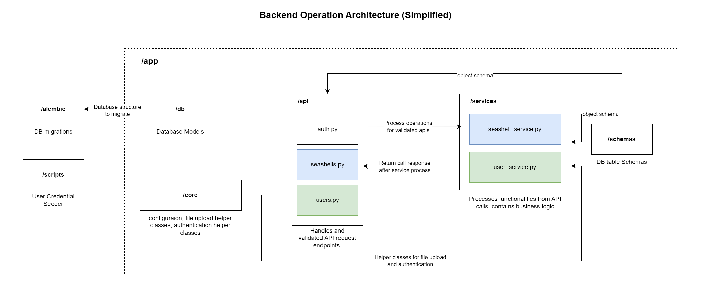

# Seashell Management Backend (kone-cloud-developer-trainee-assignment)

> Repository of technical assessment project for KONE summer trainee (Cloud Developer) position. Please refrain from using this for personal or professional use. This repository will be archived after the recruitment process is completed. 

## Overview
The project is a backend application for managing seashells and is intended to be used internally by James and Anna. It provides APIs for managing users and seashells. It also provides APIs for authentication and authorization. 

## Tech Stack

- **Backend**: FastAPI (Python 3.11+)
- **Database**: PostgreSQL 16
- **ORM**: SQLAlchemy
- **Migrations**: Alembic
- **Authentication**: JWT (Bearer Token)
- **Deployment**: Docker Compose

## Important Functionalities

**Authentication:**
- Login (email + password)
- Logout
- Current user info (to show the user name/email in the UI and confirm session)

**User Management:**
- Seed initial users (one-time: create first user(s) by migration/CLI)
- Create new user
- List users
- Activate/Deactivate user (instead of deleting users)
- Reset user password

**Seashell Management:**
- Add seashell
- Edit seashell
- Delete seashell
- View seashell list
- View seashell details

**Interactions:**
- Filter by species (dropdown)


## Project Structure
Directory Structure:
```bash
app/
  api/            # Versioned API endpoints
  core/           # Config, security, OpenAPI setup
  db/             # Models, session, repositories
  schemas/        # Request/response validation
  services/       # Business logic
alembic/          # Database migrations
scripts/          # Seed helper scripts
documentation/    # Documentation resources with front end instructions
uploads/          # Uploaded seashell images
```

Backend Architecture:

[](documentation/seashell-erd-backend-architecture.drawio.png)

## Database Structure

1. `users` table
2. `seashells` table

[](documentation/seashell-erd.drawio.png)

## Quick Start (Setup Instructions)

### 0. Prerequisites

Install the following before proceeding:

| Tool | Version | Download |
|------|---------|----------|
| Python | 3.11+ | [python.org](https://www.python.org/downloads/) |
| Docker Desktop | Latest | [docker.com](https://www.docker.com/products/docker-desktop/) |
| Git | Latest | [git-scm.com](https://git-scm.com/) |


### 1. Clone Repository

```bash
git clone https://github.com/rifatshampod/seashell-management-backend.git
cd seashell-management-backend
```

### 2. Create Virtual Environment

**Windows:**
```powershell
python -m venv .venv
.venv\Scripts\Activate.ps1
```

**macOS/Linux:**
```bash
python3 -m venv .venv
source .venv/bin/activate
```

### 3. Install Dependencies

The dependencies are listed in the `requirements.txt` file. Install them using pip:

```bash
pip install -r requirements.txt
```

### 4. Configure Environment Variables

Use the `.env.example` file as a template and rename it to `.env` (to make this tech assessment easier, the values in `.env.example` are already set):

```bash
cp .env.example .env
```

### 5. Start PostgreSQL Database

```bash
docker-compose up -d
```

Verify database is running:
```bash
docker ps
```

### 6. Run Database Migrations

```bash
alembic upgrade head
```

### 7. Seed Initial Data

```bash
python scripts/seed.py
```

**Default Test User:**
- Email: `test@seashell.com`
- Password: `password123`

### 8. Start Development Server

```bash
uvicorn app.main:app --reload
```

Server runs at: **http://localhost:8000**


## API Documentation
Upon successfully deploying the application in local server, the interactive API documentation in Swagger UI will be available at: **http://localhost:8000/docs#/**

Detailed instructions on how to use the API documentation can be found in the **[Frontend Integration Guide](documentation/Frontend_integration.md)**.


## Frontend Integration
As this is only the backend functions without any frontend UI, the APIs need to be integrated with a frontend application. Detailed instructions on how to integrate the APIs and about the data fields can be found in the **[Frontend Integration Guide](documentation/Frontend_integration.md)**.

## Design Note:
- **Register:** user registration is disabled as the system is for internal use only by James and Anna. In case new users are needed in future, either James or Anna can add new users after logging in to the system. For starter, a default user is created with email `test@seashell.com` and password `password123`. 
- **Search:** search functionality is not implemented, rather it is left to the frontend to implement. The whole seashell list is fetched from the backend and the frontend can implement the search functionality as per their requirement.
- **Bearer Token:** Bearer token is used for authentication and for the simplicity of the assessment, it is not implemented as a middleware and it is **not a refresh token**. For future production, it should be implemented as a middleware and it should be a refresh token.


