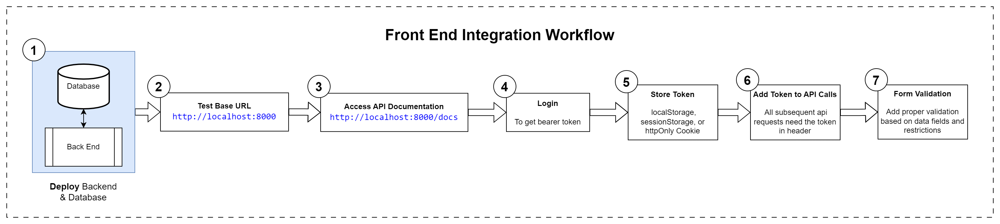
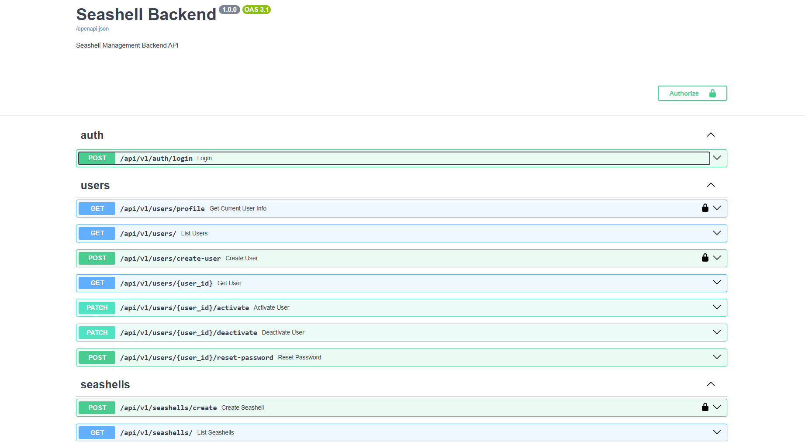
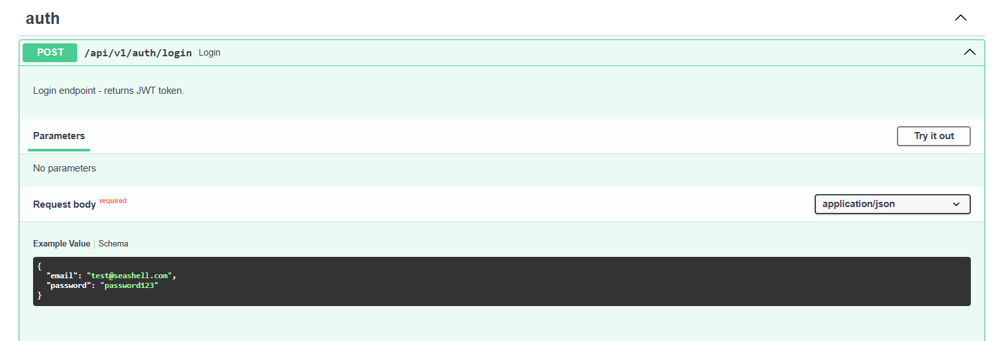
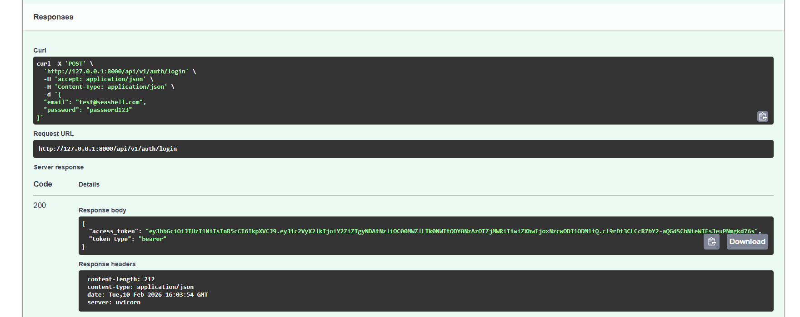
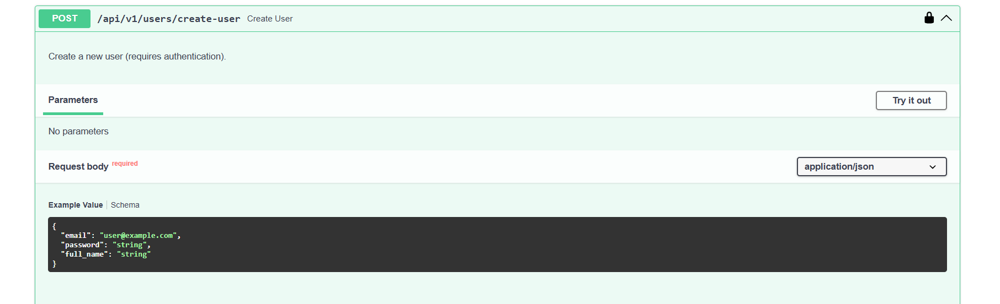

# Frontend Integration Guide Overview

This guide provides all necessary information for integrating a frontend application with the Seashell Management Backend API. The API follows RESTful principles and uses JWT-based authentication for secure access to protected resources.

## Core Workflow
[](seashell-front-end.png)

### Step 1: Deploy the Backend and Database 
See the [Quick Start guide](../README.md#quick-start-setup-instructions) for instructions on how to deploy the backend and database.

### Step 2: Base URL

**Development:**
```
http://localhost:8000
```
All API endpoints are prefixed with the base URL. For production, the base URL will be different.

### Step 3: Access API Documentation

Once the backend is deployed and running on the same device, the interactive API documentation in Swagger UI will be available at: **http://localhost:8000/docs#/**. 
The documentation UI can be used to test the API endpoints and to understand the API structure, which looks like this:

 

Every API endpoint has a "Try it out" button which can be used to test the API endpoint.

### Step 4: Login
The following image shows the API endpoint for logging in with default user credentials:

 

After clicking the "Try it out" button and then "Execute" button with the default user credentials in API body, the following response will appear:

 

Here after successfully logging in, a JWT token (`access token`) will be received in the response body, which can be used to authenticate with the backend. This token can be used to access all the protected endpoints. To access the protected endpoints, the token should be included in the Authorization header in the format: `Authorization: Bearer <token>`.
> To test the protected endpoints in the Swagger UI, the token should be added in the "**Authorize 🔓**" button in the top right corner of the page.

### Step 5: Store JWT Token (Front end example)
It is recommended to store the JWT token in a secure place, such as localStorage, sessionStorage, or httpOnly cookie to use in the requests made from front end application. 

For example, in React application, the token can be stored in localStorage as follows:

```javascript
localStorage.setItem('token', token);
```
and to use the token in the requests made from front end application, it can be retrieved from localStorage as follows:


**Example using JavaScript Fetch:**
```javascript
const token = localStorage.getItem('access_token');

fetch('http://localhost:8000/api/v1/seashells/', {
  headers: {
    'Authorization': `Bearer ${token}`
  }
})
```

**Example using Axios:**
```javascript
axios.defaults.headers.common['Authorization'] = `Bearer ${token}`;
```

### Step 6: Understanding API calls
It is very important to use correct HTTP methods and correct body parameters (where applicable) for the API requests. For example, the following image shows the API endpoint for creating a new user:

 

For this api request, the following information is required:

- API Endpoint: `{base_url}/api/v1/users/create` ({base_url} is the http://127.0.0.1:8000/ for development)
- HTTP Method: `POST`
- Content-Type: `application/json`
- Body Parameters: `email`, `password`, `full_name`

Where for creating or updating a seashell, the following information is required:

- API Endpoint: `{base_url}/api/v1/seashells/create` or `{base_url}/api/v1/seashells/{seashell_id}` (for updating)
- HTTP Method: `POST` or `PATCH`(for updating)
- Content-Type: `multipart/form-data` (different for file upload)
- Body Parameters: `name`, `species`, `description`, `color`, `size_mm`, `found_on`, `found_at`, `storage_location`, `condition`, `notes`, `file`

> **File Uploads**: To upload files, use the `multipart/form-data` content type.

**Success Response (200 OK):**
```json
{
  "access_token": "eyJhbGciOiJIUzI1NiIsInR5cCI6IkpXVCJ9...",
  "token_type": "bearer"
}
```

**Error Responses:**
- `401 Unauthorized`: Invalid credentials
- `403 Forbidden`: Inactive data

#### Common Success Response Format

**Seashell Object:**
```json
{
  "id": "3fa85f64-5717-4562-b3fc-2c963f66afa6",
  "name": "Beautiful Shell",
  "species": "Conch",
  "description": "A stunning conch shell found on the beach",
  "color": "Pink",
  "size_mm": 150,
  "found_on": "2024-01-15",
  "found_at": "Miami Beach",
  "storage_location": "Cabinet A, Shelf 2",
  "condition": "Excellent",
  "notes": "Very rare specimen",
  "image_url": "/uploads/seashells/3fa85f64-5717-4562-b3fc-2c963f66afa6/abc123def456.jpg",
  "added_by_id": "7b98c654-3421-4562-a1bc-1d852e55bfa3",
  "created_at": "2024-01-15T10:30:00",
  "updated_at": "2024-01-15T10:30:00"
}
```

**Delete Response:**
```json
{
  "message": "Seashell deleted successfully",
  "id": "3fa85f64-5717-4562-b3fc-2c963f66afa6"
}
```

**List Response:**
```json
[
  {
    "id": "3fa85f64-5717-4562-b3fc-2c963f66afa6",
    "name": "Beautiful Shell",
    ...
  },
  {
    "id": "4ab95f64-6818-5673-c4gd-3d074g77bgb7",
    "name": "Another Shell",
    ...
  }
]
```


### Step 7: Form Validation (Data Types and Restrictions)

#### Add/Edit Seashell Form Handling 

| Field | Type | Required | Restrictions | Example |
|-------|------|----------|--------------|---------|
| `name` | string | Yes (create) | Max length 120 | "Pink Conch Shell" |
| `species` | string | Yes (create) | Max length 120 | "Conch" |
| `description` | string | No | Text field | "Found during vacation" |
| `color` | string | No | Max length 60 | "Pink" |
| `size_mm` | integer | No | Positive integer | 150 |
| `found_on` | date | No | ISO 8601 format (YYYY-MM-DD) | "2024-01-15" |
| `found_at` | string | No | Max length 200 | "Miami Beach" |
| `storage_location` | string | No | Max length 150 | "Cabinet A, Shelf 2" |
| `condition` | string | No | Max length 50 | "Excellent" |
| `notes` | string | No | Text field | "Very rare specimen" |
| `file` | file | No | Image file (see below) | [Binary file data] |

#### Image Upload Restrictions

| Property | Value |
|----------|-------|
| **Allowed Formats** | `.jpg`, `.jpeg`, `.png`, `.gif`, `.webp` |
| **Maximum Size** | 5 MB (5,242,880 bytes) |
| **Content-Type** | `multipart/form-data` |

#### Date Format

Dates must be in **ISO 8601 format**: `YYYY-MM-DD`

**Valid Examples:**
- `2024-01-15`
- `2023-12-25`

**Invalid Examples:**
- `01/15/2024` (US format)
- `15-01-2024` (Day-first format)

------------------------------------------------------------------------------------------------

## Additional Instructions

## Error Handling

### Error Response Format

All errors follow a consistent format:

```json
{
  "detail": "Error message describing what went wrong"
}
```

### HTTP Status Codes

| Status Code | Meaning | Common Causes |
|-------------|---------|---------------|
| `200 OK` | Success | Request completed successfully |
| `400 Bad Request` | Invalid input | Invalid file type, malformed data |
| `401 Unauthorized` | Authentication failed | Missing/invalid/expired token |
| `403 Forbidden` | Access denied | Inactive user account |
| `404 Not Found` | Resource not found | Seashell ID doesn't exist |
| `413 Payload Too Large` | File too large | Image exceeds 5 MB limit |
| `422 Unprocessable Entity` | Validation error | Missing required fields, wrong data type |
| `500 Internal Server Error` | Server error | Unexpected server-side error |


## Image Upload
Images can be uploaded in two ways:
1. **During seashell creation/update** - Include the image file in the create/update request
2. **Separately** - Upload image after seashell creation using the dedicated upload endpoint

### Method 1: Upload During Create/Update (Recommended)

**Advantages:**
- Single request
- Atomic operation (if image fails, seashell creation is rolled back)
- Simpler frontend logic

**Example:**
```javascript
const formData = new FormData();
formData.append('name', 'Pink Conch');
formData.append('species', 'Conch');
formData.append('file', imageFile);

const response = await fetch('http://localhost:8000/api/v1/seashells/create', {
  method: 'POST',
  headers: {'Authorization': `Bearer ${token}`},
  body: formData
});
```

### Method 2: Separate Upload Endpoint

- **Method:** `POST`
- **URL:** `/api/v1/seashells/{seashell_id}/upload-image`
- **Auth Required:** Yes
- **Content-Type:** `multipart/form-data`
- **Form Fields:**
  - `file` (required) - Image file

**Use Case:** When you need to add/replace an image for an existing seashell.

**Example:**
```javascript
const formData = new FormData();
formData.append('file', imageFile);

const response = await fetch(
  `http://localhost:8000/api/v1/seashells/${seashellId}/upload-image`,
  {
    method: 'POST',
    headers: {'Authorization': `Bearer ${token}`},
    body: formData
  }
);
```
### Accessing Uploaded Images

Images are stored at:
```
/uploads/seashells/{seashell_id}/{unique_filename}
```

The `image_url` field in the seashell response contains the full path:
```json
{
  "image_url": "/uploads/seashells/3fa85f64-5717-4562-b3fc-2c963f66afa6/abc123def456.jpg"
}
```

**Display in HTML:**
```html

```


------------------------------------------------------------------------------------------------

End of Frontend Integration Guide

